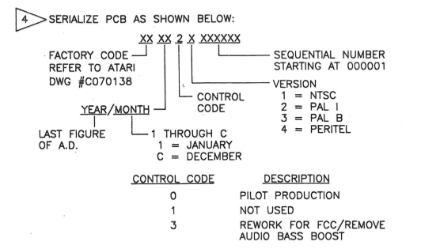
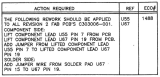
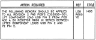
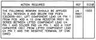
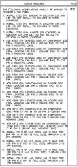
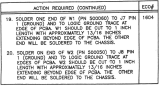
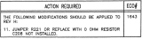
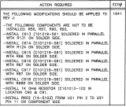

## Schematic / PCB history

### PCB flavours

The main PCB has following production numbers:

- **CA401332-001** ASSY PCB FALCON030 NTSC (US/CAN; Atari last revision: J)
- **CA401332-002** ASSY PCB FALCON030 PAL-I (GERMANY, generally most of Western Europe, Australia, and New Zealand; last Atari revision: H)
- **CA401332-003** ASSY PCB FALCON030 PAL-B (UK, generally UK, Ireland, Hong Kong, South Africa, and Macau; last Atari revision: H)
- **CA401332-004** ASSY PCB FALCON030 PERITEL (FRANCE; last Atari revision: A)

- **700015-003** (newer C-Lab MK II)
- **700015-005** (C-Lab MK X)

### Manufacturers

There had been two large Falcon manufacturers: ATMC and EFA. ATMC had used two sub-contractors, "Golden Horse" (B3) and "ECS Tamsui" (B5), EFA just one, "Ta Yuan" (Y4). EFA had been developing all Falcons since PCB rev. B. List of all Atari manufacturers [here](500277ra.pdf).

### Serial numbers

This is one big mess. According to this diagram in the Falcon030 service manual:

it should be pretty straightforward but it is not. There are several discrepancies:

1. **Number of digits**: [ECO statistics document](ECOSTATX.pdf) uses serial numbers with the control code having "0" prefix, few Falcons developed by B3/B5 and all of the Y4 Falcons follow this scheme, too
2. **Colour encoding**: Early falcons from B3 and B5 follow the rules and include the number indicating colour encoding in their serial number. All of the Y4 Falcons however skip this number (or insert zero there, hard to say with such low sequential numbers) and rely solely on the PCB production number.
3. **Sequential numbering**: It's more or less clear that every factory used its own numbers. However from the numbers I have it seems that the sequence number was reset few times even in the same factory.

### Manufacturing years

From all the serial numbers I've seen so far one can conclude:

1. First batch happened during 10-12/1992 in **B5**, this was also the only batch producing Peritel models
2. Second batch happend in 02/1993 in **B3**, **B5** and during 12/1992-02/1993 in **Y4**
3. Third batch happend in 04/1993 in **B3** (s/n numbering reset) and during 03-09/1993 in **Y4** (s/n numbering reset)
4. Fourth batch happend in 01/1994 in **Y4** (s/n numbering reset)
5. Fifth batch happened in 09/1994 in **Y4** for C-Lab MK II (and maybe MK X) models (s/n numbering reset). Interestingly, one can find PCBs with the old production number (Atari's) as well as the new one (C-Lab's) from this very same month.
6. Sixth and the last batch in 12/1995 in **Y4** for C-Lab MK X models (s/n numbering reset)

If we can trust the ECO statistics document, the last approval activity for Falcon stuff had happend around 06-07/1993.

Sometime in 09/1994 (judging from MK II serial numbers) C-Lab had ordered by EFA another batch for the MK II/X models which were delivered around 08/1995 according to [this article](http://www.stcarchiv.de/stc1995/05_sylvie.php) in ST-Computer.

Another rather confusing fact is that revisions are not always related to manufacturing years. So it's totally OK to see rev. D/C from 01/1994 and rev. J from 07/1993.

### Number of Atari Falcons manufactured

In [this intereview](http://stcarchiv.de/stc1993/10/interview-atari-bob-gleadow) in ST-Computer, Bob Gleadow, Managing Director at Atari Deutschland GmbH, claimed that in 10/1993 Atari had sold around 13,000 - 14,000 units and had 4164 units in stock.

Rodolphe Czuba [recalls](https://groups.google.com/d/msg/comp.sys.atari.st/OWDA8q3ydi0/vVPerqBk_VwJ) that the number of Falcons sold must be between 10,000 - 12,000 from Atari and 1,000 - 2,000 from C-Lab. The complete batch done was 20,000 units but only 12,000 were assembled and put to market. The remaining 8,000 units were sent (in various state of completition) from Sunnyvalle, USA to Germany (C-Lab) in two big cargo flights.

Highest s/n values per factory:

- B5: 900 (02/1993)
- B3: 402 (02/1993) + 192 (04/1993)
- Y4: 3015 (01-02/1993) + 11903 (03-09/1993) + 266 (01/1994) + 1477 (09/1994) + 211 (12/1995)

That gives us **16,678** known original Falcon030 units and **1,688** known C-Lab units. Therefore it's safe to assume the number isn't higher than 20,000.

Still the question whether C-Lab had ordered something from EKA remains -- the ST Computer article mentions MKII models still from the Atari batch but quoting C-Lab representatives about a C-Lab batch ordered from EFA directly, for later MKII and MKX models, so who knows? Altough it's hard to understand why they would order another batch if they had 8,000 semi-completed units in stock?

Anyway, it has been verified on multiple occasions that C-Lab did reuse older boards for their "new" products -- i.e. it's normal to find a MKX with motherboard from 05/1993. So while Bob Gleadow's numbers would put us somewhere between 17,000 - 18,000 built units (which is quite close to ~16,000 from serial numbers in 10/1993) I think the real count is closer to Rodolphe Czuba's statement and many MKI/MKII/MKX simply reused already existing PCBs.

### PCB revisions

Schematic C303007-001 rev. | Schematic rev. date | PCB rev. | PCB approval date | Description | PCB rev. changes | Notes
-------------------------- | ------------------- | -------- | ----------------- | ----------- | ---------------- | -----
A	| 23/07/1992 ||| Initial release
B	|	25/08/1992 ||| Revised per ECO #1488 
C	|	25/08/1992 ||| Revised per ECO #1492
D	|	25/08/1992 ||| Revised per ECO #1497
E	|	|||			Revised per ECO #1498 
F	|	10/09/1992 | A || Revised per ECO #1505	| NTSC A, PAL-I/B A, PERITEL A | Production release; PERITEL models had socketed CODEC and no RF modulator
G	|	06/01/1993 | B | 26/01/1993 |	Revised per ECO #1600  || There's no PERITEL version manufactured anymore
H	|	20/01/1993 | C | 16/03/1993 |	Revised per ECO #1604  
|| D | 16/03/1993 | Revised per ECO #1613 || Common D/C release, manufactured for Atari between 03/1993 - 09/1993, later sold by C-Lab as MKI models
|| E |	02/03/1993 | Revised per ECO #1621
|| F | 30/04/1993 | Revised per [ECO #1625](Eco1625.pdf) || Corrected error made on ECO #1604
J	|	11/06/1993 | G | 04/08/1993 | Revised per [ECO #1642](Eco1642.pdf) | NTSC G | Improved video quality for NTSC machines
K	|	06/08/1993 | H | 04/08/1993 | Revised per [ECO #1643](Eco1643.pdf)  |	NTSC H, PAL-I/B G	| Attempt to fix sound crackle during DMA playback
L	|	06/08/1993 | J | 04/08/1993 | Revised per ECO #1641  | NTSC J, PAL-I/B H
||||| PAL J | Strangely, there are records of Falcons from 07/1993 with this revision. Maybe done by an Atari dealer in post production to D/C PCBs?
||||| PAL K |	C-Lab Falcon MKII, manufactured in 09/1994

Schematic 500047-001 rev. | Schematic rev. date	| Description | Notes
------------------------- | -------------------	| ----------- | -----
1	|	06/01/1993 ||Initial release (spin-off from rev.G?)
A	|	01/03/1993 || Engineering release
B	|	13/05/1993 | Revised per ECO #1644 | Production release
