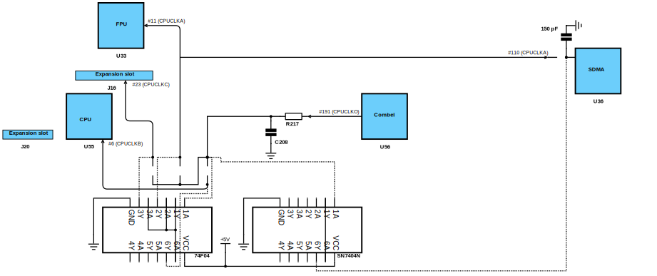

# Clock patch
This is a website trying to explain the clock patch for the Atari Falcon in layman's terms. As a bonus, you can find here [history of all known schematic and PCB revisions](history.md), with details of every change (if available).

Purpose of this site is not to shock you with some new findings but gather the existing knowledge. If you google for Falcon clock patch, you'll get very fragmented information with blurry schematics and very often not even in English language but in German or French instead. Basically, all the great knowledge is burried in old magazines, FidoNet archives and ancient Usenet groups' posts.

I'd like to meet two goals with this little project, one is to encourage people to get again interested in this confusing little mod (esp. those who do not know what is it about at all) and second is to get some feedback from people who *do* know but don't have time and/or energy to explain all the details to others but maybe would like to correct errors or add a bit of information.

## What is it?

It is a small patch (or mod if you like) for the three main Falcon clock signals (fed to the CPU, FPU+SDMA and the expansion slot), usually (but not always) utilising one or more 7404 and/or 7408 [gates](https://en.wikipedia.org/wiki/Logic_gate).

## What does it do?

The 7404 is a hex [inverter](https://en.wikipedia.org/wiki/Inverter_(logic_gate)), i.e. it can invert six independent inputs from high to low and vice versa. It has 14 pins, 6x2 are input and outputs, the remaining two are VCC (+5V) and GND (ground). 

The 7408 is, on the other hand, a quad 2-input [AND gate](https://en.wikipedia.org/wiki/AND_gate), i.e. it can do boolean AND operation on four independent pairs of inputs. It also has 14 pins, 4x(2+1) are inputs and outputs,  the remaining two are VCC (+5V) and GND (ground).

If only one IC is used, it is usually mounted on top of U63 which offers several nice features:
- it's the closest to the three clock inputs
- it's the same width as the 7404 so if you put it on U63, they will match nicely
- most importantly, it provides the needed VCC and GND pins

Important thing to realise when building clock patch is which *family* (or technology) the 740x was used to manufacture given gate. There are [many families](https://en.wikipedia.org/wiki/7400_series#7400_series_derivative_families) available, I focus only on those interesting to us:
- **74F0x**: "Fast" 740x, 3.4ns gate delay
- **74LS0x**: "Low-power Schottky", 10ns gate delay
- **74HCT0x**: "High-speed CMOS TTL voltage", 8ns gate delay

To make things even more confusing, various manufacturers guarantee different delay times. So it does matter whether the gate is manufactured by Motorola (in the past...), Philips or Fairchild. The manufacturer can be sometimes guessed from the gate name prefix, for instance:
- **SN740x**: Texas instruments, Fairchild, ...
- **DM740x**: National semiconductor, ...
- **MC740x**: Motorola (for historical reasons)

But it's not guaranteed, it's not unusual that more than one manufacturer share the same prefix. And often there's no prefix at all and you just have to look it up in catalogue (or via Google). Seriously, WTF?

The delay means how much time the gate needs to perform given operation. As you will see, this is very important factor for different clock patches!

To make our 740x journey complete, the "N" suffix means plastic through-hole DIP package, in other words, the usual long legs so you can solder them to U63's legs. Strangely, even this has influence on the clock patch quality, other packages (for instance those SMT-like ICs) are said to work much less reliably in certain scenarios.

## Why does it exist?

The problematic parts of Falcon's design are demonstrated here (right-click on the image and choose something like "Open image in new tab" or "View image", then you can zoom it in as you wish, it's a vector image):

We can see that the main clock signal (16.1079525 on NTSC machines, 16.042494 MHz on PAL/Péritel) goes from the Combel (also known as the Combo IC :)) via **R21** (27 Ω, back side of PCB), having **C208** (10 pF, back side of PCB; not present on PCB since rev.H) as a low pass filter and finally through **R217** (0 Ω) right into three resistors: **R216** (33 Ω), **R221** (33 Ω, changed to 0 Ω in PCB rev.H) and **R222** (33 Ω).

Why there has to be a 0 Ω resistor (R217) I have no clue but it's not that what causes trouble. The problem are those three clock signals branching from it, esp. the one going to the SDMA (*Sound and SCSI Direct Memory Access*, did you know?) where the clock travels first to the FPU and then to the other end of the PCB.

Those three paths basically distribute the main clock to all important Falcon ICs so they can work synchronously. Unfortunately, those paths are very poorly shielded so one IC can very easily disturb another. Especially in the cases with high data bus load (typically displaying video in high resolutions) SDMA problems become nearly unavoidable.

Sane solution would be to make those paths as short as possible and of course make each path buffered.

Atari hadn't realised the problem until it was too late. As you can see in the [schematic / PCB history log](history.md), the first attempt to fix had appeared in August 1993, i.e. by the time when Atari would be shutting down Falcon manufacturing.

Note: Michael Ruge mentions also arrival of fast SCSI hard disks in the beginning of 1994 as one of the triggers but honestly, this doesn't seem to hold very well as there are audio problems also without SCSI disks.

## How do I know I need it?

There are two or three typical symptoms (as mentioned, typically surfacing in higher resolutions):
- SCSI read/write errors, corrupted data
- crackles during sound playback (corrupted data between SDMA and DSP and/or DAC)
- Floppy disk read/write errors (especially in Falcons with accelerated bus)

As you can see, the worst possible scenario is recording audio, using DMA run it trough the DSP and write output to a SCSI disk in 720x512x16bit resolution. :)

Atari used [this tool](f030test.zip) to verify fixed Falcons -- if you see green bars from left to right, you're good. Red bars mean trouble.

## How and where the mod is done?

Not surprisingly, the heart of all changes are always those three/four resistors because they are exit points to the three clocks - A, B and C; and the SDMA itself (because that's where the errors happen).

I wish I could tell you that those gates are doing some well defined operation which Atari engineers just forgot to implement. The truth is that nobody really knows what's happening there and why the gates help (!).

There are various theories what effect the gate(s) and/or resistors and/or capacitors have on the clock paths:
- the basic idea is that the gates serve as some kind of protection against the signal going backwards (if something comes to an output pin, it wont get trough the gate)
- effect of a delay: resulting in SDMA's clock input either being phase shifted or even delayed by whole tick what leads to avoiding a conflict on data bus
- weaker signals or better filtered signals (less prone to fail due to random noise)
- different voltage levels
- different impedance

### Variant 0 (author: Atari Corp.)
[ECO #1643](Eco1643.pdf) for PCB rev. H (NTSC) and G (PAL-I/B) respectively first recognises the problem in August 1993.

The fix is simple and apparently does the job for some Falcons. Just remove C208 (beware, located on the other side of PCB) and short circuit R221. That's it.

### Variant 1.1 (author: Atari Corp.)
This fix used to circulate among users as a scanned [fax page from Atari Benelux](74F08.jpg) and it had been said to try as the default fix for Falcons with both unaccelerated and accelerated bus.

This rather confusing variant does the following:
- keeps *CPUCLKB* to the CPU intact
- strengthens (no resistor) and delays *CPUCLKA* to the FPU and SDMA by *74F08*'s gate delay (ANDing the same value on input produces the same value on output)
- delays *CPUCLKC* to the expansion slot by *74F08*'s gate delay
- isolates the two signals from going backwards

Note: I've seen this clock patch with a 74LS08, too.

Interestingly, *DoIt F030* claims this schematic is broken and warns the reader that this discrepancy between the CPU clock and others would result in non-working Falcon, "surely with a 060 CPU". There's a proposed change to use AND gates for all three signals.

On the other hand, the authors of the *BlowUp FX-Card* recommended a similar approach: not using *74F08* but *74F04*'s inveters for *CPUCLKA* & *CPUCLKB* -- basically [Variant 1.2](#variant-12-author-atari-corp) without *CPUCLKC*.

### Variant 1.2 (author: Atari Corp.)
Another well known scanned [fax page from Atari Benelux](74F04img.gif), dated Oct 7, 1994. It had been said to try if [Variant 1.1](#variant-11-author-atari-corp) doesn't help.

It's the most common clock patch spread around. The idea is that the clock signal from R217 comes into the 74F04 as *1A*, goes inverted out as *1Y* which in turn feeds *4A*, *5A* and *6A*. Each gate inverts the signal again (i.e. it has the original value) and outputs it as *4Y*, *5Y* and *6Y* into the respective clock paths.

This basically strengthens the signals (no resistors), delays them (by the 74F04's gate delay times two, around 7ns) and isolate them from going backwards. Works well usually only for Falcons without accelerated bus.

**Interesting discovery: if you have installed *PowerUp 2* or another CPU speeder, the wire from *4Y* doesn't go directly to *R222*'s pad but to the PU2 box instead (where the CPU clock is doubled when PU2 is active). From there it goes to *R222*'s pad. However, with the *CT60(e)* this seems to break things, perhaps because of the wire length. Removing this detour not only made the CT60e boot straight away (before I had to boot into 030 mode first) but also solved a [mysterious overheating problem](http://www.atari-forum.com/viewtopic.php?f=97&t=31461) of the 74F04.**

### Variant 1.3 (author: Atari Corp.?)
Chips'n Chips says this is supposed to be in all Falcons rev. D/C manufactured after Dec 1, 1993 (what sounds rather strange as Atari hadn't manufactured any Falcons after September or so, perhaps C-Lab MK I Falcons? -- I did see such variant in an MK I from 09/1993).

It's a variation of [Variant 1.1](#variant-11-author-atari-corp):
- keeps *CPUCLKB* to the CPU intact
- strengthens (no resistors) and delays *CPUCLKA* and *CPUCLKC* by *74F08*'s gate delay
- isolates the two signals from going backwards (but doesn't care to isolate one from each other?)

### Variant 1.4 (author: Line Audio Design)
This one is rather interesting, it combines the basic 74F04 patch with some of the 2.x variants, i.e. grounding the SDMA:

- strengthens (no resistor) and delays *CPUCLKB* and *CPUCLKC* by *74F04*'s gate delay times two (around 7 ns)
- weakens (33 Ω -> 47 Ω), grounds (by another resistor - 83 Ω) and delays *CPUCLKA* by *74F04*'s gate delay times two (around 7 ns)
- so all signals are equally delayed and protected from going backwards plus the SDMA fix

### Variant 1.5 (author: Petr Stehlík)
Invented as a workaround for floppy problems in the [FT/20 speeder](https://joy.sophics.cz/hard.htm#falcon).

It's basically an inversion of [Variant 1.1](#variant-11-author-atari-corp) / [Variant 1.3](#variant-13-author-atari-corp):
- strengthens (no resistor) and delays *CPUCLKB* by *74F04*'s gate delay times two (around 7 ns)

It was used in a Falcon without the FPU so perhaps the reason why it worked was that the SDMA had lighter 'load' then.

### Variant 1.6 (author: Exxos)
Inspired by [Variant 1.4](#variant-14-author-line-audio-design), then extended with the buffer resistors as described [here](http://www.exxoshost.co.uk/atari/last/falcpatch/index.htm#EXXOSMOD), i.e. it's  basically [Variant 1.2](#variant-12-author-atari-corp) with resistors put back (although of different values).

It seems a *74**HCT**04* and definitely non-N type is used making this clock patch fit mainly for Falcons with unaccelerated bus.

### Variant 2.1 (author: Peter Green & Black Scorpion Software)
Perhaps first published with their Nemesis accelerator. It basically uses [Variant 1.2](#variant-12-author-atari-corp) with some additional changes, made especially for Falcons with accelerated data bus.

- the *7404* is upside down and *VCC*/*GND* are not connected to *U63* anymore because this clock patch used be delivered on a PCB -- voltage is taken usually from the big 4700 pF capacitor
- if I understood remark in [this thread](http://www.atari-forum.com/viewtopic.php?f=27&t=30187&p=298944#p298883) correctly, originally they used a *74**LS***04 (but I saw also a Nemesis with plain *SN7404N*)
- strengthens (no resistor) and delays FPU's *CPUCLKA*, *CPUCLKB* and *CPUCLKC* by *7404*'s gate delay times two (around 15-20 ns, depending on the IC)
- completely disables *CPUCLKA* path for the SDMA, replacing it with output of yet another inverter, terminated by a 150 pF capacitor (pin #14 of the AJAX chip (U20) is used as *GND*)
- the most interesting change are the two new capacitors: one seems to be for filtering input voltage (?) and the other for filtering SDMA's *CPUCLKA* **input**

Simbo's version on Atari Forum uses a *74**HCT**04* with a 47 pF capacitor instead of 33 pF.

In ST Computer 06/1998 Michael Ruge describes a simplified version, [Variant 1.2](#variant-12-author-atari-corp) + the SDMA signal line cut but without any further grounding or filters. He does, however, mention an option to use another *74F04* with different number of passes through the inverters specifically for the SDMA line.

Sometimes you can see a combined approach from [Variant 4](#variant-4-author-rodolphe-czuba) -- a capacitor terminated by a 1 kΩ resistor (usually seen in AfterBurner 040 Falcons).

### Variant 2.2 (author: Ctirad Feřtr)
This one (developed by the author of the Phantom accelerator) is considered to be the best clock patch available. It should work with any Falcon, with either accelerated or unaccelerated data bus. It basically combines most of the features and research results from other patches.

As we can see, it's nearly identical to [Variant 2.1](#variant-21-author-peter-green--black-scorpion-software):

- it uses two different gate ICs
- the gate ICs **must** be as specified, i.e. FPU/CPU/expansion slot signals are delayed by the *74**F**04*'s delay times two (around 7 ns) and SDMA signal is delayed by the *SN7404N*'s delay times two (around 18 ns)
- the [PhantomS accelerator](http://mujweb.cz/boban07/PhantomS) used *74**HCT**04* ICs for both inverters rendering the whole idea of different delays basically useless

### Variant 3 (author: Michael Ruge)
This one is simple, just shortcut input and output of each of the three R2xx resistors. Interference isn't cured but they are stronger and this can help.

### Variant 4 (author: Rodolphe Czuba?)
This one is also simple, it basically only grounds / terminates the SDMA signal line with a resistor:

- the author explicitly mentions the need of the three resistors and removal of any previous clock patches (it's not 100% clear what to do if complete [Variant 0](#variant-0-author-atari-corp) is applied, whether also *C208* should be put back)
- pin #14 of the AJAX chip (U20) is used as *GND*
- the resistor must be as close to the SDMA as possible and the soldered area must be as short as possible

## How do I know it worked?

Well, the first good sign is that the Falcon still boots. :) Then you can do various tests:

- copy a big zip/lzh/arj archive to your floppy/SCSI hard disk and run the unarchiver's "verify" option on it
- copy a lot of small files into a directory on your floppy/IDE/SCSI disk and then compare the directory trees with `TREE_CHK` from Kobold
- set a very demanding resolution, like 864x640/256 and try direct-to-disk recording with a huge sample to SCSI hard disk -- you should hear it on playback without any crackles

## References

Credit where credit's due! Sorted by volume of information taken from there:

[Atari Falcon030 Service Guide](http://dev-docs.atariforge.org/files/Atari_Falcon030_Service_Guide.pdf) hosted by Lonny Pursell

[Clock patch explanation in JoyAIP](http://phoenix.inf.upol.cz/~opichals/libhyp/hypview.cgi?url=http://joy.sophics.cz/joyaip.hyp&dstenc=latin2&index=93) by Petr Stehlík

[Chip'n Chips](http://phoenix.inf.upol.cz/~opichals/libhyp/hypview.cgi?url=http://dev-docs.atariforge.org/files/chips.hyp) by Michael Ruge and hosted by Lonny Pursell

[DoIt Falcon030](http://dev-docs.atariforge.org/files/Doit_Archives-ELiTE_2006.zip) by Robert Schaffner, published by ELiTE and hosted by Lonny Pursell

[Falcon troubleshooting](http://www.holmerup.com/trouble.html) by Claes Holmerup (found on the [website](http://members.optusnet.com.au/~startreks/falccct.html) by Mark Bedingfield)

[Falcon clock signals](https://mikrosk.github.io/ct60tos/rodolphe.czuba.free.fr/Museum/F30_Clocks.jpg) by Rodolphe Czuba

[Phantom installation manual](http://www.volny.cz/boban07/PhantomS/phantom_manual.rtf) by and discussion with Ctirad Feřtr

[Nemesis installation manual](http://dev-docs.atariforge.org/files/Nemesis_Manual.pdf) by Peter Green & Black Scorpion Software and hosted by Lonny Pursell

[Falcon acceleration problems](http://www.stcarchiv.de/stc1998/06/falcon-beschleunigen) by Michael Ruge

[CT60/63 fitting guide](http://powerphenix.com/CT60/english/fitting63.htm) by Rodolphe Czuba
