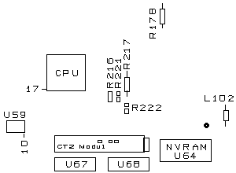
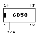
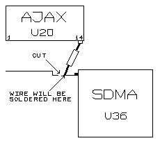
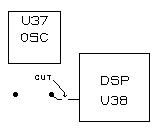
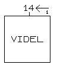
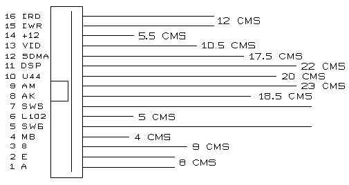
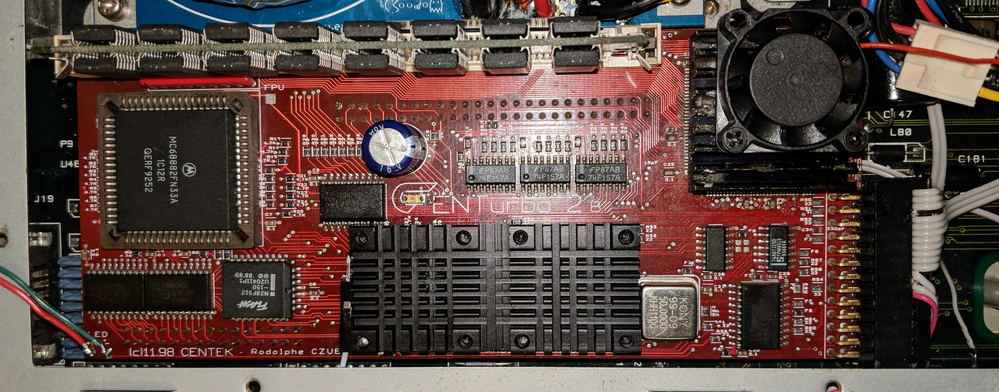

# Fitting

## Precaution
Many components of the CT2 are sensitive to static electricity: avoid touching the card and especially the pins of the components and connectors. Hold the card by the edges. Please make sure your body is discharged of static electricity, example, touch a metallic object that is in contact with the ground (tap for example), the best would be to touch a metal chassis (without paint) of an electrical appliance connected to the ground (toaster for example). Be careful with carpets and synthetic clothes... Don't walk barefoot on the carpet.

## Tools
- Phillips screwdriver.
- Thin flat pair of pliers.
- Soldering iron, 30 to 40 Watts, with very thin tip and connected to the ground(!) Make sure the outlet you use has a ground, and this ground wire is really connected to the ground. If you don't own the place, don't trust what you might see if you undo the cover of your electrical outlet. You may destroy one or several chips of your beloved Falcon if you use a soldering iron without ground. (except some high end soldering iron equipped with an anti-static system).
- Good tin solder, 60% tin and 40% lead.
- Small utility knife with a new blade.
- Thin pin.
- Transparent adhesive (scotch-tape).
- A centimeter ruler.
- Something to make a hole (sharp scissors or a drill).

And eventually:
- Pair of pliers (very thin) to cut electric wires.
- Pair of pliers to strip the wires insulation off.
- For the FPU, a flat screwdriver very thin or PLCC extracting pliers.

## Orientation
The instructions and other placement indications are to be visualized and followed as if the mother board was in front of you, as if you were using the computer.

## Undoing the Falcon
Flip over the machine, undo the 7 screws from the case and the 3 long ones from the floppy drive. Flip the machine over again and remove the case. Undo the power supply cover screws. Undo this cover. Disconnect the floppy drive. Undo the 2 screws from the legs of the power supply, then remove the power supply along with the connector. Undo the screws of the cover remaining (all along the mother board), you will then bend the little tips straight up in order to remove this cover. Disconnect your memory card.

## Preparing the mother board
If a CENTurbo I is installed, you need to remove it, as well as all the wires connected to it. Some of the following procedures won't need to be done since they were already done.

*Applies to rev.A:*[\*](NOTES.md#removal-of-old-cpu)

With the thin pin and the soldering iron, unsolder and bend the **pin 17** of the **CPU**. This pin is on the front left corner of the CPU (see picture). Cut 3 cms of the included black wire, strip the wire insulation off and tin it. Solder one end of this wire onto the **pin 10** of **U59** (see picture). Solder the other end of the wire onto the CPU bent pin (previously done).

***Explanation:** Grounding CPU's pin 17 (BGACK-, Bus Grant Acknowledge) via U59's pin 10 (GND) indicates that an external device has become the bus master.*

*Applies to rev.B:*[\*](NOTES.md#removal-of-old-cpu)

With a cutter, **remove** the old **CPU** 68030 from the mainboard (see figure to localise the CPU). BE CAREFULL to not touch the mainboard and tracks with the cutter ! Use the border of the CPU case to guide your cutter.

Remove with the iron solderer the rest of the pins that are yet on the mainboard's contacts.

Verify, with a magnify if possible, that there is no short-cuts between two contacts.

*Continue for both revisions:*

With the thin cutting pliers or utility knife, cut then bend up slightly the **pins 3 and 4** of the **ACIA 68B50 (U24)** near the MIDI sockets, same operation for the keyboard **ACIA (U52)** close to the left of the keyboard connector.

***Explanation:** ACIA's pin 3 (RXC) and 4 (TXC) are chip's 500 kHz receive and transmit clock inputs respectively.*

Locate the **SDMA (U36)** (hint: where the floppy drive was). Cut the track that goes to **pin 110** (second pin from the top) of the SDMA (see picture).

On the right side of the track, scratch the varnish (2 mm long) until you reach the metal, then tin it. Take the resistor of the package and cut the pins at 5 mm from the body. Solder it between the **pin 14** of the **AJAX (U20)** and the track of the SDMA like on the picture.

***Explanation:** Grounding SDMA's pin 110 (BCLK) via AJAX's pin 14 (GND). This cuts off the SDMA from the original CPUCLKA (now disabled) 16 MHz clock.*

Locate the **DSP (U38)** (hint: where the floppy drive was). Cut the track that goes from the (big) hole far right of the 32MHz clock (U37) (left of DSP) to DSP **pin 74**. (see picture). The cut has to be as near as possible of the hole, and the length has to be at least 1 mm. On the right side of the track, scratch the varnish (2 mm long) then tin it.

***Explanation:** DSP's pin 74 (EXTAL) is external 32 MHz clock input. This cuts off the DSP from the U37's 32 MHz clock.*

Locate the **VIDEL (U34)**. Locate **pin 14**, counting to the left from the right back side. In front of this pin, there is a metallic hole connected to this pin. With the tip of the utility knife, scratch the varnish until you reach the metal, then tin it. Be Careful with the videl.

***Explanation:**: Videl's pin 14 (EXTCLK) is external (Genlock) clock input.*

If you have a **FPU** installed in the falcon, you need to **remove** it. If you don't have PLCC extracting pliers, use a small flat screwdriver as lever on the 2 opposite corners of the socket.

If you have an **IDE** disk drive, leave the ribbon cable on the connector of the mother board. Count starting pin 1 (bottom part of the connector) and locate the 23rd and the 25th wire (use a marker) of the ribbon cable (falcon side). With your utility knife, separate the **wire 23** and the **wire 25** from the others for about 2 cms long (starting from the connector, falcon side). Cut those wires (23 and 25) as close as possible to the connector.  You need to strip the insulation of the wire 23 and 25, then tin them. NEVER unconnect the ribbon cable from the ribbon connector or your will have bad contacts!

***Explanation:** pin/wire 23 (IDEIOW) and pin/wire 25 (IDEIOR) are IDE I/O write and read signals respectively.*

Cut as close as possible to the mother board the left pin of L102 which is located next to the NVRAM. Bend it (see picture) and tin it.

***Explanation:** The bent pin is the 32.084988 (PAL) / 32.215905 (NTSC) master clock input. Through the L102 it then leads to Combel's pin 20 (CLK) and Videl's pin 44 (CLK32).*

If it wasn't done already, **remove** the resistors or solder bridge on **R221** and **R222** on the right side of the CPU (see picture). If there is a solder bridge or there is no resistor on **R216**, you will need to **place one there** (after removing the eventual bridge), using the one furnished on this paper. Without this resistor on R216, the CT2B may not work correctly !
Be carefull that the track around the R216 place is not cut !

***Explanation:** Combel outputs 16 MHz (half of the master clock) on pin 191 (CPUCLK) and then through the R217 a signal called CPUCLK0. CPUCLK0 is divided into three branches:*
- *R221 creates the CPUCLKA which leads to the SDMA and FPU. As the SDMA has been cut off and FPU removed, the signal is not needed anymore.*
- *R222 creates the CPUCLKB which leads to the CPU. As the CPU has been removed/suspended, the signal is not needed anymore.*
- *R216 creates the CPUCLKC which leads to the expansion slot. This signal is definitely needed.*

*So basically we eliminate the branching, creating the best possible clock patch.*

Locate on the left  side of the mother board the 2x8 contacts referenced as **U46**. **Unsolder** the **4th** contact (starting from the left) and **solder** the **3rd** contact (see picture).

***Explanation:** this changes a propery for the ROM from one wait state to two wait states (i.e. ROM access is slower by about 10% in 4.04 mode). This setting is reflected in $fff8006 bits 2 & 3.*

**Remove** from their sockets, the 4 chips 2x10 pins **U62**, **U63**, **U67** and **U68** (towards you on the mother board). Those won't be used anymore. Remove from its socket the chip 2x12 pins **U44** (near the DSP) and **break pin 15**. **Tin the pin 15 of the socket** (be careful with the plastic).

***Explanation:** U67 decodes the address for the DSP, U68 is used to generate Bus Grant for 68000 type devices and U44's pin 15 (XDSP_CS) is the DSP Chip Select signal.*

With the black wire, cut 2 small wires of 2 cm.

Solder one wire from **pin 2** to **pin 17** of **U62**.

***Explanation:** XVPA -> XVMA (Valid Memory Address)*

Solder the other wire from **pin 8** to **pin 17** of **U63**.

***Explanation:** XDTACK (Data Transfer Acknowledge) -> EXPAND (Expansion Data)*

Install the switch on the left side of the Falcon case between the cartridge port and enhanced joystick ports. To do so, make a 6mm diameter hole (scissors or drill). Position the switch in such a way that it will switch from HIGH or LOW (vertical way).

*Applies to rev.B only:*[\*\*](NOTES.md#external-video-clock)

Solder a short pin of a 33 ohms 1/4 W resistor (orange/orange/black/gold) in the **right hole** of **U37**, the place of the DSP 32 MHz oscillator (see picture).

Cut the other pin of the resistor as short as possible and solder a thin wire (black wire furnished in the last packages only) between this pin and the hole of the **pin 14** of the **VIDEL**. This wire MUST be as short as possible, straight, and not in contact with the mainboard !
Use the forward plastic border of the mainboard floppy connector to fix the wire in the best straight position.
Software remark : you should turn always OFF the 'External clock' setting in the set-up F7, when using the CT2.

***Explanation:** This is to feed Videl's pin 14 (EXTCLK) with the DSP's original 32 MHz clock. Note: this clock is 32.000000 MHz and not 32.084988 (PAL) / 32.215905 (NTSC) as originally present on Videl's pin 44 (CLK32).*

## Ribbon cable
Place the ribbon cable on a piece of a hard cardboard, and separate using the utility knife the wires until the connector. Then cut the wires at the length required (as shown on the diagram), strip the insulation of the wires (2mm) except the ACIA wires (4mm). Twist them together then tin them.

If you want to have pin 1 indicated by the red wire, you have to turn the IDC connector upside down because IDC has pin 1 in the top row while CT2 in the bottom row:

You then need to solder the 16 wires of this ribbon cable starting by wire n1,  finishing by the wire n16. Some wires will need to be secured on the mother board with some adhesive tape. Be careful in not having wires crossing (especially near the connector), the ideal would be to have all the wires parallel to each others.

FOLLOW THESE RULES:
- Don't EVER make a loop with a wire like for example going around a component's leg.
- Don't cross together the wires anywhere - VERY IMPORTANT ! -
- The wires MUST be separated on all the longer of the ribbon. Stay as straight as possible and keep the most important distance between each wires: a wire disturbs the others and is disturbed by the others (Electro Magnetical Interferences = EMI).
- Don't put a wire over a chip: the activity of the chip will disturb the signal of this wire !

Solder:
- the wires n1 (A) on the pin 13 of U62.

***Explanation:** CT2 -> ADDR0*

- the wire  n2 (E) on the pin 6 of U62.

***Explanation:** CT2 -> QC*

- the wire n3 (8) on the pin 1 of U63. *(Applies to rev.A only)*[\*](NOTES.md#removal-of-old-cpu)

***Explanation:** U63's pin 1 (CLK) had (now disabled) CPUCLKB clock here. This replaces the original 16 MHz clock with 8 MHz and continues to the old CPU.*

- the wire n4 (MB) on the motherboard: the pin left of the L102 placement (and not the pin of L102 that is bent up).

***Explanation:** CT2's 50 MHz clock feeding back to the motherboard.*

- the wire n5 (SWG) on the superior pin of the switch.

***Explanation:** Ground for the CT2 on/off switch.*

- the wire n6 (L102) on the left pin of L102 (see picture).

***Explanation:** The original master clock is fed to CT2 here.*

- the wire n7 (SWS) on the middle pin of the switch.

***Explanation:** CT2 'on' wire.*

- the wire n8 (AK) on the pin 3 and 4 of the keyboard ACIA.

***Explanation:** 500 kHz clock to the keyboard ACIA's RXC/TXC pins.*

- the wire n9 (AM) on the pin 3 and 4 of the MIDI ACIA.

***Explanation:** 500 kHz clock to the MIDI ACIA's RXC/TXC pins.*

- the wire n10 (U44) on the pin 15 of U44 socket (NOT the chip). Break the pin 15 of the chip U44, and insert it back on its socket.

***Explanation:** U44's DSP Chip Select signal is replaced by the one from CT2.*

- the wire n11 (DSP) on the cut track going to the DSP.

***Explanation:** CT2's 50 MHz clock feeding the DSP.*

- the wire n12 (SDMA) on the cut track and resistor connection near the SDMA (see picture).

  

***Explanation:** CT2's 25 MHz clock feeding the SDMA.*

- the wire n13 (VID) on the tinned hole of the VIDEL. *(Applies to rev.A only)*[\*\*](NOTES.md#external-video-clock)

***Explanation:** CT2's 32 MHz clock (most likely the original Falcon's master clock) feeding the VIDEL on its external clock input.*

- the wire n14 (+12) on the front pin of R178 (see picture).

***Explanation:** +12V to power the CT2.*

- the wire n15 (IW) with the wire n23 of the IDE  cable (the one that goes to the peripheral).
- the wire n16 (IR) with the wire n25 of the IDE  cable (the one that goes to the peripheral).

***Explanation:** CT2's replacement signals for IDE I/O access.*

Remove the jumper of the mother board bus.
Put the power supply unit back in and remove the screw in the bottom right corner that fix the supply PCB on the metal bracket (the heatsink/fan module of the CT2 will need place).

Before inserting your FPU in the CT2 FPU socket, check its speed written on the chip (68882FNxx). The following versions react differently at 50MHz:
- 16/20 MHz:     Doesn't work at 50 MHz !
- 25 MHz:        Not recommended...
- 33 MHz:        No problem what so ever at 50 MHz.

Be careful when inserting the FPU, the pin 1 has to be in the center of the right side. ONLY IF the pin 11 of your 'old' FPU is raised, don't  try to move it (it may break). Use the small squared pad on the CT2 just near the socket. You have only to use a 1 cm wire (from the black wire) between this pad and the raised pin 11 of the FPU.

You now need to insert the CT2 on the Falcon bus. For this you need to place the card over the bus first to see if it is aligned correctly. Then apply an equal pressure with your left thumb on the solders of the left female connector  and your right thumb on right female connector in order to fully insert the CT2. Attention: don't apply pressure on any of the CT2
components. Insert the connector of the ribbon cable in the right side of the CT2. Insert, if not done already, the SIMM in the socket.

If you have the gray ATARI VGA adaptor and if you don't have a multisync monitor, some extended video modes with the external clock at 32 MHz won't be possible without modifying this adaptor (which is bugged !). You need to flip it and cut with the utility knife into the plastic, a 1cm wide strip on the whole length and at 4mm of the metallic border.  After this you can
access the inside, you separate the pin 15 from the pins 11 and 19. Move aside the 2 wires connected to pin 15, cut them as close as possible to the pin and connected them together. If you don't want to do this hack, you can get 2 DB19 (male and female) that you will solder (direct cabling) without connecting the pin 15 (cut them). This little adaptor will be inserted
between the Falcon VGA port and the gray ATARI VGA adaptor.[\*\*\*](NOTES.md#atari-vga-adaptor)

The installation is done. Put the machine back together and boot it with the switch on the LOW position (NORMAL mode). If the computer works, copy on your hard drive the file from the installation floppy, then decompress it.
Then, flip the switch (TURBO mode) and press the RESET:
- you should boot into a blue page, then a menu should appear.
- Press F7 and verify your FAST-Ram and your eventual FPU are well detected.
- Verify the delay about the IDE is set. If your IDE HDD is slow, the access without this delay may crash (if a software like XBOOT writes, your bootable partition may be crashed !).
- Continue to boot by pressing the ESC key.

If you have a SCSI hard disk, run 'CC_TOOLS' (from the CECILE folder) to test 'transfer consistency'. If the software reported some transfers errors, read the section about [SCSI/Audio setting](SOFTWARE.md#ide--scsi-transfers--audio-setting) !

## Thermic aspects
The CT2 are equipped with heatsink + fan, stuck to the CPU with thermical cyanoacrylate glue. Don't try to remove this block or you will damage the CPU ! This block has been glued in a position that won't bother the keyboard (if still using the original case). An 3 1/2 inch IDE hard drive will remain between the power supply unit and the floppy drive, but far behind and along the CT2 heat dissipater. If you have a 2 1/2 inch IDE HDD (65, 80 or other capacity), you have to cut the left forward pin of the metal bracket and remove the four screws (two on each side of the HDD). Then screw again the
bracket on the motherboard and stick (double-faced adhesive or glue) the HDD on the bracket at the far behind position.

ATTENTION: if using the original Falcon case, it is necessary to keep the motherboard fan running.. If you think it is still too noisy, you can reduce its speed in adding a 47 Ohms resistor in the red wire.

We even recommend (sometimes really needed) to add a third fan which will expel the hot air from the casing out. This fan has to be installed near the power supply unit, which is one of the first reason of this hot air. The ideal would be to cut the shape in the case then glue it on the left side.

Or another solution, faster but not as efficient, place the 3rd fan between the power supply unit and the top case. Never put some objects like papers on the top case !

***Note from mikro**: nowadays is pretty easy to find various cooling solutions from the PC/RPi world. Personally I'm happy with a much smaller heatsink on the CPU, a small fan made for the RPi and a large heatsink for the two ISP chips (accidentally bought as one pack with two fans like the one on the CPU). That provides me a rock solid stability with no crashes, overheating or freezing of the Falcon whatsoever.*

## Power LED
In the bottom left corner of the CT2 card you can find two solder pads for a LED of your choice. Its purpose is to signalise whether the CT2 is active.

## Summary
So what has been done in a nutshell:
- The old 68030 CPU has been removed *(Rev B)* / is fed from CT2's 8 MHz and being instructed that another external devices has become the bus master *(Rev A)*.
- The old 68882 FPU has been removed.
- The master clock has been replaced by 50 MHz, overclocking the VIDEL and COMBEL to 50 MHz and the Blitter and `CPUCLKC` to 25 MHz.
- `CPUCLKA` and `CPUCLKB` signals have been deactivated.
- The SDMA clock (`CPUCLKA`) has been replaced by CT2's 25 MHz.
- The DSP clock (U37) has been replaced by CT2's 50 MHz.
- The VIDEL external clock is fed from U37's 32 MHz *(Rev B)* / from CT2's 32 MHz (or from an external device) *(Rev A)*
- Keyboard & MIDI ACIA clocks have been replaced by CT2's 500 kHz as the original 500 kHz clock from the COMBEL can't be used anymore (as it is 1.56x faster now).
- Access to ROM is slower by one wait state (important for NORMAL and TURBO 4.0x modes).
- IDE I/O read/write accesses are handled by the CT2.
- Most of the 68000 bus decode PALs have been replaced by the CT2's logic.
