# Notes

## Removal of old CPU
**(\*)** In a Falcon with CENTurbo II, the old CPU actually continues to be internally electrically active, clocked by a 8 MHz signal from the CENTurbo II logic. By doing so, it continues to draw power and dissipate thermal energy into the confines of the Falcon's case, while serving no useful function to the machine.

## External video clock
**(\*\*)** The VID signal from CENTurbo II has been replaced by direct 32 MHz oscillator originally used for the DSP. Before this change one could decide whether to use external video clock from the CT2 itself ("ext.clock" ON in the Flash BIOS) or to use video clock from a real external source like the BlowUP ("ext.clock" OFF in the Flash BIOS). However due to the fact that nobody had been using BlowUP or similar extensions along with the CT2 as well as due to instability of the clock generated by the CT2 on its VID pin, a workaround has been implemented leading to a stable 32 MHz clock (used mainly for feeding EXTCLK with timing compatible with RGB modes).

*Centek had published this explanation: External clock from CT2B is not wired because of a recently discovered disturbance of the DSP clock! It is not recommended to use this feature as it will be no longer supported!*

## Atari VGA adaptor

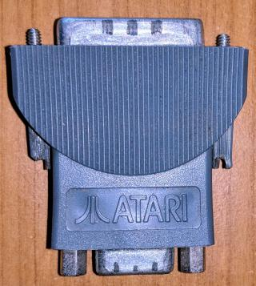

**(\*\*\*)** If you happen to own this adaptor you might be wondering what is the problem exactly. Internally it has its pin 19 (M0), pin 15 (external clock input) and pin 11 (ground) connected together. So that M1+M0 = %10 bin = 2 dec (VGA) and external clock input is disabled. If CT2 (or any other external Videl clock like the Screen Blaster, BlowUP etc) wants to feed its own clock to Videl's pin 14, it can't have Videl pin 14 (which is in turn connected to DB19's pin 15) grounded.

The modification proposed by Centek connects pin 15 and pin 11 together (having only M0 grounded). The adaptor they mention would simply ignore the grounded pin 15 because the adaptor's pin 15 wouldn't be connected at all.

Another approach is to desolder SMT resistor R49 which connects Videl's pin 14 and DB19's pin 15 on the PCB.

Either way, you don't need this modification (or another adaptor) anymore as connecting an external clock has been [no longer recommended](#external-video-clock) and Videl's pin 44 (EXTLCK) is not affected by the grounded pin on the adaptor.

## Videl: why CLK32 (pin 44) gets 50 MHz and not EXTCLK (pin 14) ?
**(\*\*\*\*)** At first it looks very logical -- keep 32 MHz on `CLK32` to have RGB modes compatible with the original timing and feed `EXCTCLK` with 50 MHz for extended resolutions. However the problem is that Videl is synchronized with Combel for ST-RAM accesses via pin 44. For that reason the 32 MHz master clock (which later gets divided by two for the CPU, FPU, bus, ...) is feed equally to both Combel and Videl. In comparison, EXTCLK is purely used only for video modes, not synchronization, so it doesn't make any harm to overclock it.

## CENTurbo II Rev A vs. Rev B
There is a few differences between the two revisions:
- Rev A is pass through: you can install another card on top of the CT2A (although using ribbon cables, not directly). Access to the CPU is 32-bit @ 25 MHz
- Rev A can address max. of 32 MB TT-RAM while Rev B can access 128 MB (Rev A uses a generic National Semiconductor controller while Rev B uses a custom one in CPLD)
- Rev A has slower write access to TT-RAM (6 cycles vs. 4 cycles with Rev B)
- Rev A doesn't allow to write-protect the flash memory
- Rev A optionally offers a 36 MHz clock instead of 32 MHz on its VID pin
- (Early?) Rev A had so called "patch board" 1 and 2 (also called "Modul") located on the GALs. They were used for changing the SDMA timing. Rev B has the solder pads however there used to be also Rev B installations with only Modul's `A` and `E` connected and the solder bridge broken on both pads.

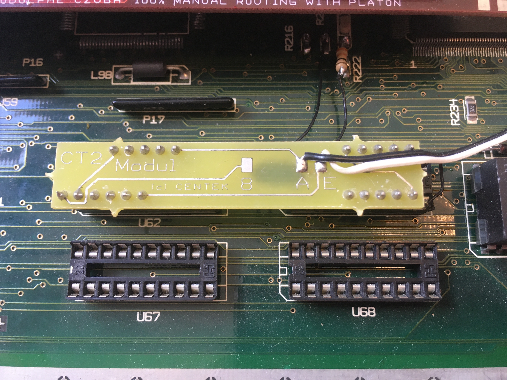
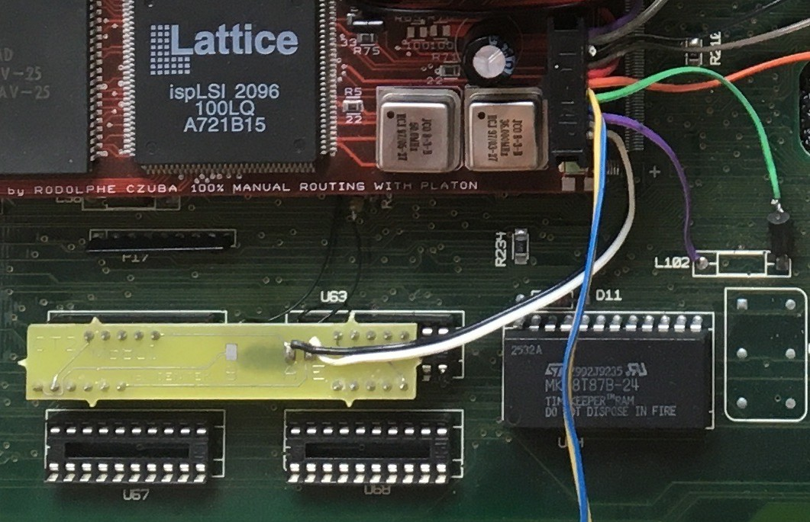

Trivia: There was an infamous 'battle' between an UK company called Titan Designs and Centek about the removal of the expansion slot pins. Titan put a warning about possible technical difficulties with the CT2B and their Eclipse PCI card (assuming that Centek had removed the pins because they couldn't get it running properly) leading to a very sharp reaction from Centek. According to Centek, the expansion slot pins were removed because of budget reasons and because nobody (?) had been really using it except them (for Dolmen OS development).

## CENTurbo II Rev AN/BN
Those are planned yet never released / developed followers of the CT2 Rev A and Rev B, respectively. The only difference was supposed to be TT-RAM area mapping: the original CT2 uses space starting at $04000000 instead of more natural $01000000 established in the Atari world and the -N revisions were supposed to fix that. Only the ISP(s) needed to be updated, no hardware change was required.

The reason behind the $04xxxxxx address space was easier decoding logic in the ISP chips. Centek developers had thought that using the PMMU would be enough to solve any incompatibilities but they hadn't realised that a lot of software uses its own MMU trees (Outside, MagiC, Linux, FreeMiNT, ...), assuming the standard TT-RAM mapping.

While the -N revisions have never seen the light of the day, some software got support for the CT2 after all (Linux, FreeMiNT) or a patch has been created (MagiC).

## 68030 @ 75 MHz
Early on there were plans to use a 50 MHz 68030 for the card to be able to achieve 66 - 75 MHz with overclocking. However the 50 MHz version of the 68030 was sold only in PGA package (in comparison to smaller QFP package with max. frequency of 33 MHz) what meant not only higher price tag but also more space taken on the card. So a decision had been made to use the slower 33 MHz variant and overlock it to "only" 50 MHz.

Interestingly, the idea seemed to be considered again for the CT2B but there was also information about some timing problems at frequencies higher than 50 MHz so perhaps that was the final reason why the CPU stayed at 50 MHz.

## Supported SIMM modules
CT2 uses 72-pin EDO (not FPM) 60ns (or faster) SIMM module rated at 5V. CT2A support up to 32 MB, CT2B up to 128 MB per module. CT2 can operate also without any SIMM module inserted but you would lose the benefit of *very* fast RAM accessed as 32-bit @ 50 MHz (and emulated with 16-bit @ 25 MHz instead...).

Supported configurations:
- 16 MB --> 8 chips of 4 MBits x 4
- 32 MB --> 16 chips of 4 Mbits x 4
- 64 MB --> 8 chips of 16 Mbits x 4
- 128 MB --> 16 chips of 16 Mbits x 4

Special care must be taken when aiming to fit CT2 into standard Falcon case. There is a few options, neither of which is fully satisfactory:
- low profile (21mm) 16 MB SIMM with 8 chips on one side only --> this provides the best fit (it's low enough and not in the way of keyboard plastic) but, well, it's only 16 MB ...

- low profile (21mm) 32 MB SIMM with 8 chips on each side --> this provides nearly a good fit but the other side gets in the way of keyboard plastic so you can't fully 'clip' the keyboard to Falcon plastic case (making pressure on the CT2 card and/or SIMM connector and/or SIMM chips). A lot of filing needed.

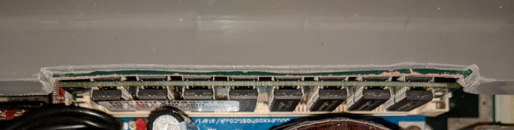

- low profile (22mm) 64 MB SIMM with 4 chips on each side --> this provides a very good fit, it's perhaps the best possible SIMM to install into CT2. Only very little filing is needed (and that is mostly only to make room for the PCB, not for the chips). However it's very hard to locate such a module.

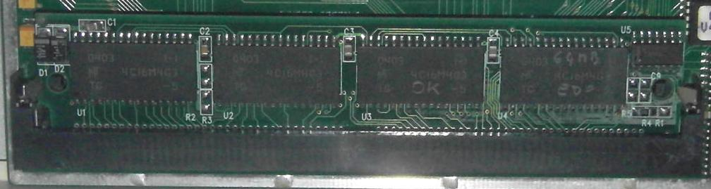

- low profile (24mm with chips in the lower area) --> Altough this 64 MB SIMM is a bit taller, it still requires very little filing because only the PCB is in the way. You don't have to file the whole 'hole'; you can make a 'cap' because the SIMM module isn't that tall.

 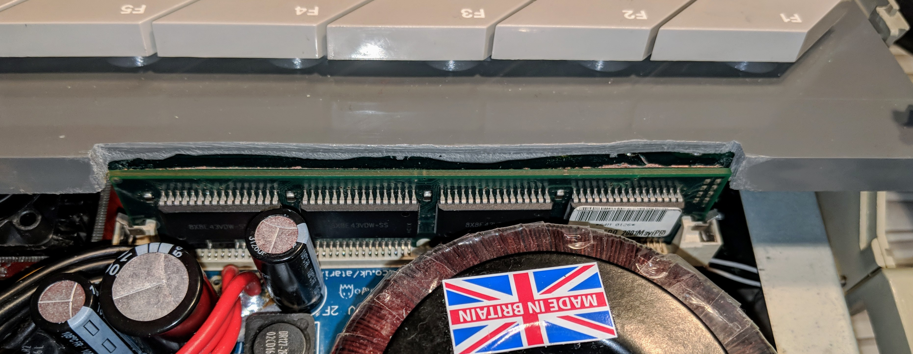

- low profile (25mm and thin) 64/128 MB SIMM --> this requires a bit of filing to make room for the SIMM module but you don't have to file the whole 'hole'. You can make a 'cap' because the SIMM module isn't that tall. If the chips are only on one side (64 MB), you can get away with very little filing.

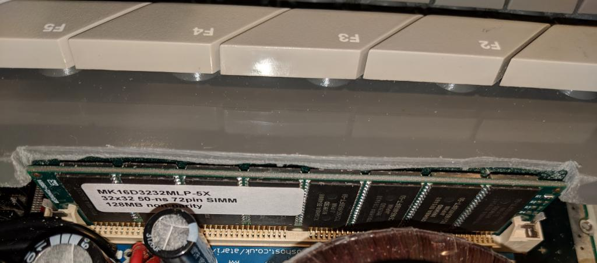

 - low profile (29mm but still thin) 64/128 MB SIMM --> this requires a bit more filing to make room for the SIMM module but on the other hand these are quite common to find. Its height is just with keyboard plastic and again, if the chips are only on one side (64 MB), you will need to file significantly less.

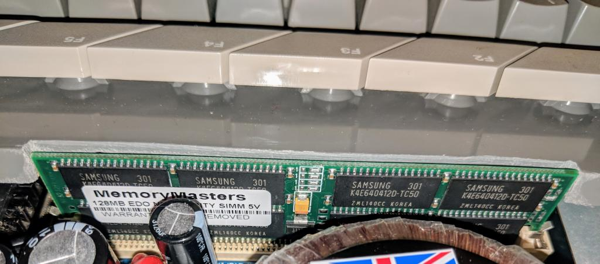

One thing to consider when hunting after the biggest possible capacity is the fact that the bigger the memory is the longer it takes to initialise the flash setup (not to be confused with the TT RAM test). With 128 MB it takes about two seconds before the setup starts. 32 MB is virtually immediate, 64 MB takes about a second.

## DSP IRQ signal

### Overview

Because the Falcon is built around the 68000 bus, DTACK replaces 68030's DSACK1 and the DSP sends DSACK0 (interrupt acknowledge) only to the 68030 (but not on the 68000 bus). Centek put this signal on the CT2 but it works only on a normal acces to the host port but not as an interrupt from the host port.

Centek found using the DSP IRQ (which triggers an exeption on the 68030) bad programming practice (not optimal). The good method was according to Centek to have two buffers on the DSP side and consider the DSP to be still faster than the 68030. So the 68030 reads from the host port and the DSP writes data to the same host port reading from its internal buffer (then we increment the modulo pointer in this buffer). Ditto for writing.

When you need to do a long calculation on the DSP rating and you want to signalise the 68030 that the calculation is over, so you have to use classic handshaking (the 68030 verifies that the DSP is ready before sending or writing) which is negligible in machine time if the delay is large enough.

Another speculation was that Centek does not want to implement any DSP interrupts in their Phenix computer, as the computer would allow boards with a variable number of DSPs connected. Serving the DSP interrupts could get rather messy with that system, so they did not want to do it at all. They didn't want to do anything for the Falcon in a way different from what they plan for the Fenix, as they regarded the Falcon mainly as a 'testbench' for Phenix development.

### Fix

This is the procedure by Didier Méquignon:

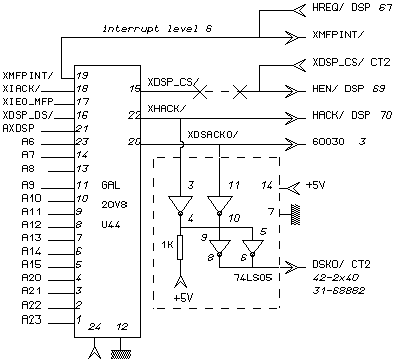

1. Bend the pins of the new 74LS05 to the outside except #14.
2. Solder a 1K resistor between pins 10 and 14 of the 74LS05.
3. Connect together pins 4, 5, 9 and 10 on the 74LS05.
4. Place the 74LS05 on GAL U44 as shown on the picture.

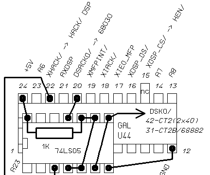

5. Solder pin 14 of the 74LS05 on pin 24 of U44.
6. Solder remaining wires between 74LS05 and U44 as shown on the picture.
7. Connect a wire at pin 6 and 8 of 74LS05 to the pin 42 on CT2 2x40 connector or pin 31 of 68882 on CT2B.

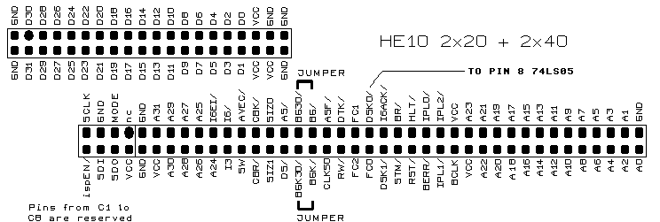

Now you can remove DSP_IRQ.PRG in your auto-folder.

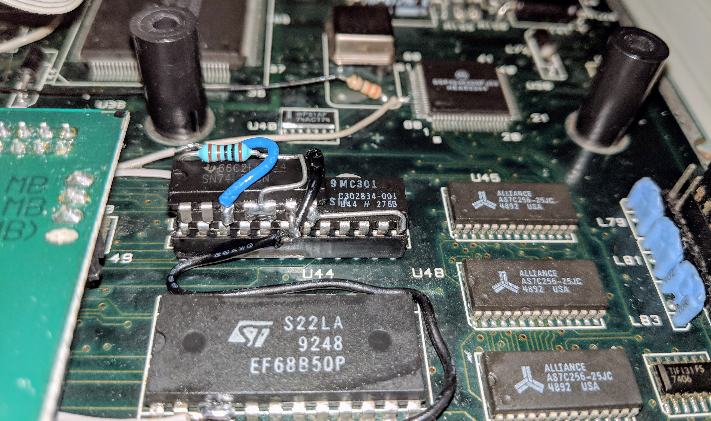

***Nice hint by Ronald Andersson** for all CT2B owners: The expansion sockets as shown in MONTAGE2.IMG do not exist, either on a Falcon or on a CT2B.  Yet all the patch files refer to that 2x20 connector and 2x40 connector, even though no connectors of those sizes exist.  This means that the suggested method of connecting the patch output to one of the pins on that connector is not possible.*

*Instead it is necessary to find a 'through-hole' on the CT2B, connected to both FPU pin 31 and CPU pin 3. One good position is between the 'innermost' corners of the Flash ROM chip and the ispLSI1016 chip.  There you can find four adjacent holes in a line pointing towards the FPU in a 45 degree angle relative to the board edges.  The one of those holes that is closest to the FPU is the one with the right signal.  Make sure you have found the right hole by measuring 0 ohms resistance between it and FPU pin 31.*

*The hole is perfect for the kind of wire used with mini-wire-wrap tools, but such wire can not tolerate much bending back and forth, so it is best to make a fixed connection terminal for it on the CT2B, to which another wire type (multistranded and thicker) can be soldered, so that it can be removed for future work without straining the singlestranded wire, or having to desolder any wires at the patch IC (piggybacked on U44).*

*I located one of the few spaces on top of the CT2B that is free of signal traces, and placed a homemade connector there made from a scrap of resistor lead bent into a suitable shape, and fixed it to the board with a glue blob.*

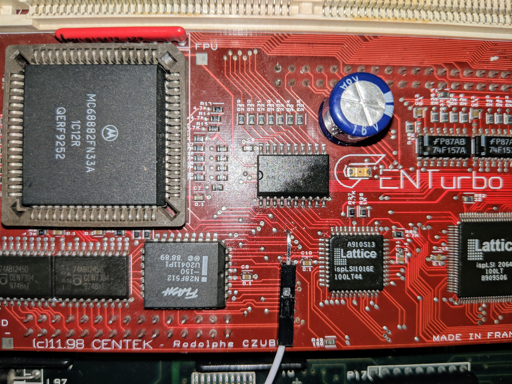

***Another approach by Didier Méquignon**: I have inserted a pin on the FPU (DSACK0 and DSACK1 are directly connected between the 68030 and 68882). Another example is the U44, I have inserted a pin in the socket (pin 15) => no solder, no pin cut.*

### Software vs. hardware patch

DSP_IRQ.PRG certainly isn't adequate replacement of this hardware mod. Some things do not work with the software patch even
though they do work with the hardware patch.  Also, the software patch will treat any 'spurious' interrupt as if it was a legal DSP interrupt, which is not good.

## NVDI 5.03 compatibility
There had been reports of NVDI 5.03 not working well with the CT2 unless you have CENTScreen installed. Otherwise you'd get GEM with text but no icons. NVDI 5.02 is supposed to be OK.

## IDE cable length
20 cm had been recommended as the maximum cable length.

## XHDI support
Early Cecile versions do not support XHDI altough later versions should.

## "Best" flash BIOS version
Rodolphe Czuba had left Centek around the time when version 1.3.2 had been produced and tested by himself. Therefore he couldn't guarantee that any later versions work reliably with "his" CT2. *(this is debatable - in my case I had a 128 MB SIMM which is properly detected on 1.3.3 as 128 MB while on 1.3.2 is detected as 64 MB; on the other hand one 64 MB was detected as 32 MB with 1.3.3 and as 64 MB with 1.3.2... -mikro ([and not only me](http://www.atari-forum.com/viewtopic.php?f=27&t=33988&p=348358#p348398)))*

Note: latest French version available seems to be 1.4.1 (with English version also [in existance](https://groups.google.com/forum/#!msg/comp.sys.atari.st/-ZqvaEx5bhM/krxnhl97EzAJ) but not available for download), latest English versions is 1.3.9 *(strangely I can't get 1.3.4 - 1.3.9 to work properly, I'm unable to leave the text instruction screen... -mikro)*

## Blitter speed and errors
The official reason why NVDI must be used is that the Blitter can't access TT-RAM in TOS 7.04. However as TOS 4.04 doesn't use TT-RAM, the Blitter should be working properly in that mode. Unfortunately, this doesn't seem to be the case - it had been suggested using slightly longer access delays in writes to some blitter registers - as the blitting errors always appears in patterns indicating that some blitter register are using the wrong source or destination address.

Note: such option is indeed present in later Flash BIOS revisions.

*Reasoning by Ronald Andersson: The only chip with direct access to DRAM address lines is Combel, so part of the blitter must reside there, but it is only Videl that has direct access to the DRAM data lines, so it should contain the rest of the blitter. Both of those chips are clocked at 50 MHz by CT2.*

*Hmmm, I can't find any verification that the BLIT logical operations are performed in VIDEL, as they really ought to be, and that explains why the Falcon blitter is not so fast as it should be. COMBEL must fetch data via VIDEL, perform the operations, and then store data via VIDEL again, and in all this COMBEL must act as a bus master, locking out the CPU. This means that to properly lock out a 50 MHz CPU it needs signal speed sufficient to manage the bus arbitration in time to prevent access conflicts. Failure to do this fast enough could explain why blitting fails even in ST-RAM at the turbo speeds.*

Note from mikro: Ronald's deduction has some merit. There are two system resources which arbitrate for the system bus separate from the CPU: the DMA (5380 SCSI controller/AJAX FDC transfers & sound accesses) and the Blitter (as part of the Combel).

## TURBO mode (4.0x) in RGB/TV mode
Since TOS is not patched in this mode, it assumes a 32 MHz Videl (instead of 50 MHz) and therefore doesn't work.
