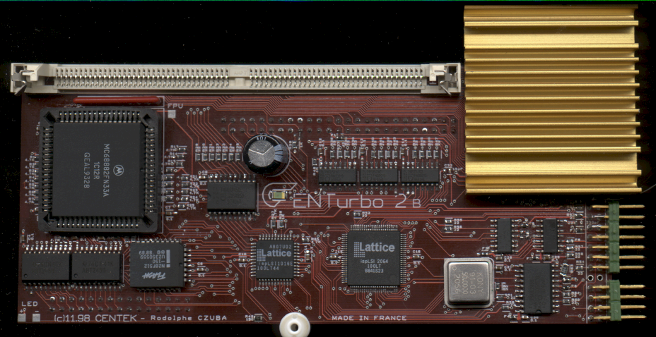
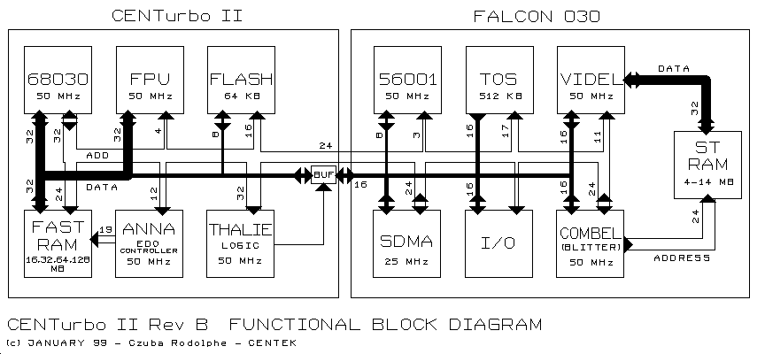

# CENTurbo II
The CENTurbo II (later known as CT2) was an accelerator card for the Atari Falcon. It was designed by Rodolphe Czuba and sold by a French company called Centek in two versions:
- Rev A: designed from January '97 to June '98 and sold from September '98 to December '98 (92 units)
- Rev B: designed from December '98 to January '99 and sold from February '99 to January '00 (150 units)

Because of the high technical goals, it was the most ambitious hardware project ever launched on Falcon market at that time.
A total of 242 units had been sold from September '98 to January '00 in 14 countries. In 2003, the CT2 was replaced by the  CT60 which remains the most powerful accelerator card available for the Falcon.

# About this site

This is a website trying to gather all publicly available information about the CENTurbo II accelerator card. This hasn't been an easy task, not only due to the time which has passed (20 years) since its inception. In the 90s, Centek didn't provide much information in general and if it did, it was first in French and then after a long pause in English (or "English"). To complicate things futher, Rodolphe Czuba (the main creator) had left Centek in 2000 and created his own website about CT2, now defunct http://www.czuba-tech.com while Centek's website was still up and updated. This all had lead to an incredible mess where French and English documentation and tools were independently updated and distributed by all parties (and later mirrored, at random times, by 3rd parties). I've tried to collect latest versions, clean it all up and provide for everyone.

If you find an error, please mention it in the [issues](https://github.com/mikrosk/ct2/issues) or fork the [repository](https://github.com/mikrosk/ct2) and provide a [pull request](https://github.com/mikrosk/ct2/pulls) (you can edit these files directly in the web editor).

Assembled by Miro Kropáček a.k.a. MiKRO / Mystic Bytes

XX/07/2018, Košice / Slovakia, Europe

# Overview

CENTurbo II offers quite an unique set of features even to today's (Atari) standards:
- 68030 CPU @ 50 MHz (replaced the original one @ 16 MHz)
- 68882 FPU @ 50 MHz (replaced the original one @ 16 MHz)
- 56001 DSP @ 50 MHz (overclocked from 32 MHz)
- Videl @ 25.175/50/32 MHz (overclocked from 25.175/32/- MHz), maintaining the option to use all VGA/RGB/mono resolutions
- Blitter @ 25 MHz (overclocked from 16 MHz; a result of Combel @ 50 MHz)
- SDMA @ 25 MHz (overclocked from 16 MHz)
- up to 128 MB TT-RAM using 32-bit EDO SIMMs @ 50 MHz (read 32.5 MB/s, write 38 MB/s)
- data bus @ 25 MHz (overclocked from 16 MHz) *(I really don't know where the advertised 50 MHz comes from, maybe it was meant as the CT2 bus being 50 MHz... -mikro)*
- ATA-4 (Ultra ATA/33) support for PATA IDE access with up to 9.7 MB/s transfer rate
- custom [clock patch](https://mikrosk.github.io/clockpatch)
- 64 KB flash eprom with custom setup
- in-house developed [tools](SOFTWARE.md#tools) for CENTurbo II managment and its features
- fits into original Falcon case (with some [restrictions](NOTES.md#supported-simm-modules))
- allows switching to an original Falcon mode (except 32-bit FPU access @ 32 MHz \[originally 16-bit @ 16 MHz\] and the [DSP IRQ problem](NOTES.md#dsp-irq-signal))

- [Software](SOFTWARE.md)
- [Fitting](FITTING.md)
- [Notes](NOTES.md)
- [Troubleshooting](TROUBLESHOOTING.md)

# Links
- [Centek](http://centek.online.fr/atari/ct2/) (fr)
- [Rodolphe Czuba](http://powerphenix.com/rodolphe.czuba.free.fr/CT2/english/welcome.htm) (en, [fr](http://powerphenix.com/rodolphe.czuba.free.fr/CT2/french/bienvenu.htm))
- [Dead Hackers Society](http://dhs.nu/files.php?t=accelerators) (en)
- [Didier Méquignon](http://didierm.pagesperso-orange.fr/) (en, fr)
- [Florent Lafabrie](http://www.lafabrie.net/old/Atari/Centurbo/Index.htm) (fr)
- [Odd Skancke](http://assemsoft.atari.org/) (en)
- [MyAtari](https://www.exxoshost.co.uk/atari/mirror/myatari/issues/oct2000/falcon.htm) (en)
- [ToXiC MaG Special Issue 3 (Centurbo II)](http://strider.untergrund.net/toxicmag/toxichs3/index.htm) (fr)
- [Alive 10 - ct2 second look](http://alive.atari.org/alive10/ct2.php) (en)
- [Atari Computing 12 - CENTurbo II](https://www.exxoshost.co.uk/atari/mags/AC_PDF/AC12.pdf) (text version [here](http://cd.textfiles.com/atarilibrary/atari_cd10/PAGES/ISSUES/AC12.ASC/REVIEWS.X/CENTURB2.X/) and [here](http://cd.textfiles.com/atarilibrary/atari_cd10/PAGES/ISSUES/AC12.ASC/REVIEWS.X/CT2_2ND.X/)) (en)
- [Undercover Magascene 16 - Experience with Centurbo II (Rev-B) and Centek..](https://demozoo.org/productions/61321) (text archived [here](archives/texts/ct2-ucm16.txt)) (en)
- [Maggie 28 - Centurbo 2 - The definitive lowdown! & Centurbo 2, the Final Chapter?](https://demozoo.org/productions/72403) (texts archived [here](archives/texts/ct2_1-maggie28.txt) and [here](archives/texts/ct2_2-maggie28.txt)) (en)
